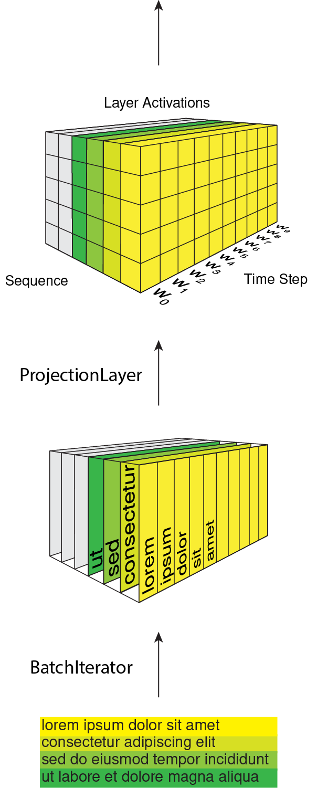

Contributing
============

You're welcome to contribute.

1. Fork the repository on GitHub.
2. Clone the forked repository into a local directory:
   ``git clone my-repository-url``
3. Create a new branch: ``git checkout -b my-new-feature``
4. Commit your changes: ``git commit -a``
5. Push to the branch: ``git push origin my-new-feature``
6. Submit a pull request on GitHub.

Source code packages
--------------------

``theanolm.commands`` package contains the main scripts for launching the
subcommands.

``theanolm.network`` package contains ``Network`` class, which constructs the
network from layer objects and stores the neural network state (parameters).
Each layer type is implemented in its own class that derives from
``BasicLayer``. These classes specify the layer parameters and the mathematical
structure using symbolic variables.

``theanolm.parsing`` package contains classes for iterating text and converting
it to mini-batches.

``theanolm.training`` package contains ``Trainer`` class, which performs the
training iterations. It is responsible for cross-validation and learning rate
adjustment. It uses one of the optimization classes derived from
``BasicOptimizer`` to compute the gradients and adjust the network parameters.

``theanolm.scoring`` package contains the ``TextScorer`` class for scoring
sentences and ``LatticeDecoder`` class for decoding word lattices.
``TextScorer`` is used both for cross-validation during training and by the
score command for evaluating text.

``theanolm.textsampler.TextSampler`` class is used by the sample command for
generating text.

Neural network structure
------------------------

A ``Network`` object contains tensors ``input_word_ids``, ``input_class_ids``,
and ``mask`` that represent the mini-batch input of the network, i.e. a set of
n word sequences, where n is the batch size. These symbolic variables represent
two-dimensional matrices. The first dimension is the time step, i.e. the index
of a word inside a sequence, and the second dimension is the sequence. The mask
indicates which elements are past the sequence end; the output will be ignored
if the corresponding mask value is zero. Theano functions that utilize the
network have these tensors as inputs. Their values will be read from a text file
by a ``BatchIterator``.

Layers receive a list of input layers in the constructor. The constructor
creates the initial values of the layer parameters. Every layer implements the
``create_structure()`` method that describe its output, given its parameters and
the output of its input layers.

The ``Network`` constructs the layer objects. First layer object is a
``NetworkInput``, which is not a real layer, but just provides in its output
either the word ID or class ID matrix. The first layer following a
``NetworkInput`` should be a ``ProjectionLayer``. It maps the integer word IDs
into floating point vectors. Thus the projection layer and all the subsequent
layers output a three-dimensional tensor, where the third dimension is the
activation vector.

